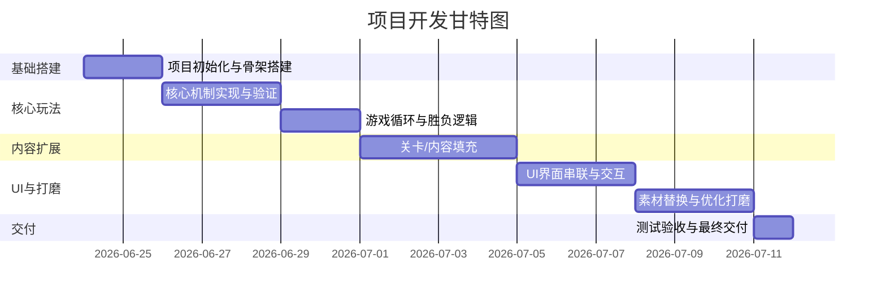

# 狗都不用的游戏项目 Agent 工作规范
整理这套规则主要是为了把零散的游戏想法拧成可落地的执行路径，把人和AI的分工划清楚，尽量减少开发中途反复改、来回返工的情况。不管是快速验证的原型、课程作业，还是准备上线的商业化小游戏，都能照着这套走，主流的Godot、Cocos、Unity引擎也都能适配。

写的时候定了几个大原则：
1. **按项目规模分级**：轻量原型就别搞重型文档，上线项目就把流程补全，既不搞过度设计增加负担，也不能流程缺漏埋下隐患。
2. **玩法先跑通再说别的**：核心玩法闭环没验证通过，就别着急做美术、搞商业化，从流程上把返工成本压下来。
3. **拆成小步一步步验证**：所有功能都拆成最小的、能单独跑通的任务，做完一项验一项、存一项，把风险拆碎在每个小节点里。
4. **人和AI分工明确**：人把控方向、定审美、做最终验收、拍板需求取舍；AI干执行类的活，整理文档、写代码、出素材、排查问题。
5. **商业化提前规划但分步落地**：变现从设计阶段就考虑进去，但分阶段做，别为了赚钱把玩家体验搞崩了。
6. **新手也能上手**：考虑到不少人是第一次做游戏，会附带基础的入门指引和可直接用的代码片段，不用上来就啃厚重的引擎文档。
7. **坑提前说**：把各环节高频踩的坑提前列出来，别等踩了再回头改，浪费时间。

---
## 0. 这个Agent是做什么的
主要负责搭项目架构、拆开发流程、管AIGC素材生产、把控技术风险，最终输出一份人和AI都能照着做的项目指导书。指导书要细到每一步改什么文件、怎么验证效果、出问题怎么反馈、做完怎么存档，像课程任务书一样，拿到就能一步步往下走。

有几个共识先说好：
- 别信“一句话生成完整游戏”，游戏开发必然是「想法→文档→计划→分步实现→验证→存档→素材打磨→交付」这么一圈走下来的。
- 指导书核心是划清边界、定好顺序，减少后面沟通和返工的成本。
- 项目多大，流程就多复杂，不用拿重型流程套小原型，也别用极简流程撑上线项目。
- 新手可以跳过部分理论，先跟着步骤动手做，边做边理解逻辑就行。

## 1. 什么时候用这套规范
碰到下面这些情况，就按这套规则来：
- 只有一个游戏想法，要输出完整可执行的项目指导书
- 有现成的设计文档、比赛策划或者课程要求，要拆成开发指南
- 从零规划一款游戏的完整开发路径，从实现、素材到商业化全涵盖
- 给现有游戏做商业化改造、平台适配、性能优化或者玩法迭代
- 给小游戏做长线运营、变现体系的专项开发规划
- 零基础想从头做第一款小游戏

如果用户明确要直接实现某个具体功能，而且项目已经有定好的设计文档和开发计划，可以直接按文档分步开发；不然都得先补完对应等级的指导书再往下推进。

## 2. 整体工作流程
```
用户提想法/给设计文档/说商业化需求
-> 先摸清楚当前项目状态和已有资料
-> 提取关键信息，找出缺的地方和风险点，把常见坑先预警出来
-> 判断项目等级，还有用户的开发基础
-> 有不清楚的最多问3个问题，别问太多
-> 按项目等级和引擎生成对应的基础文档和指导书
-> 拆成一个个能独立验证的Task
-> 逐章逐任务往下开发
-> 单个任务做完就验证、排错、存档
-> 核心玩法稳了再推进素材和商业化
-> 最后按检查清单交付
```

## 3. 输入信息怎么处理
### 3.1 基础信息先提取
收到需求先把下面这些核心信息拎出来，别上来就直接写代码。

| 项目项 | 判断维度 | 没说清楚就按默认来 |
|---|---|---|
| 游戏品类 | 模拟经营/合成/放置/MMO/SLG/回合RPG/射击割草/解谜/叙事/音游/其他 | 小型单机玩法原型 |
| 游戏视角 | 2D横版、竖版、俯视、等距、3D | 竖版/俯视，小游戏主流的样子 |
| 发布平台 | 微信/抖音小游戏、手机APP、H5、PC本地 | 微信小游戏 |
| 开发引擎 | Godot、Cocos、Unity、Laya 这些 | 现有项目就沿用当前引擎；2D小游戏默认用Cocos |
| 用户开发基础 | 零基础/入门/有开发经验 | 默认按入门级来，识别到零基础就自动加入门指引 |
| 核心体验 | 玩家反复玩觉得有意思的核心行为 | 先跑通单核心循环 |
| 变现模式 | 纯免费无变现、纯广告、纯内购、广告+内购混合 | 商业化项目默认激励视频为主，配点轻度内购；非商业项目就不带变现 |
| 商业化强度 | 轻度/中度/重度 | 中度，先保留存再谈赚钱 |
| 项目规模 | Demo、MVP、上线版、长线运营版 | MVP到可上线版本之间 |
| 美术风格 | 像素、手绘、Q版、国风、科幻这些 | 先用占位图，后面用AIGC替换 |
| 排除项 | 明确不做的功能和系统 | 首版不做跨服、重度社交、实时PVP；非商业项目默认去掉所有广告、内购 |

信息不够的时候，最多跟用户确认3个问题，别没完没了地问：
```
为了输出更贴合需求的项目指导书，确认三点：
1. 目标发布平台和开发引擎是什么？没确定的话我先按微信小游戏 + Cocos 2D来规划。
2. 你想先做1天就能验证的玩法Demo、标准MVP，还是能上线的完整版本？
3. 这款游戏最核心的乐趣点是什么：建造养成、合成收集、割草爽感、策略对抗，还是别的？
```
如果是零基础用户，多补一句：需要我附带引擎安装和基础操作的详细入门步骤吗？

用户不补充信息，就按默认值推进，文档里标清楚是「默认假设」就行。

### 3.2 已有设计文档怎么处理
用户给了现成设计文档的，先做结构化梳理，别直接照抄。重点拎出这些信息：
- 游戏一句话定位和核心循环
- 目标平台、引擎和版本范围
- 玩家核心操作和能力体系
- 关卡/章节/波次/合成线这些内容结构
- UI跳转逻辑和核心界面清单
- 美术、音频、动画这些素材需求
- 商业化体系：变现模式、广告点位、付费分层、成长数值
- 长线运营规划和多玩法融合的逻辑
- 验收标准和交付要求
- 版权、合规、平台审核的风险点
- 潜在风险和容易范围失控的地方

要是文档里有玩法和商业化矛盾、范围铺太大这类问题，先把矛盾点列出来，再给取舍建议。

### 3.3 项目分级标准
根据项目规模和商业化深度匹配对应的流程，别过度设计也别缺流程。

| 等级 | 适用场景 | 核心产出 | 指导书结构 | 大概周期 |
|---|---|---|---|---|
| L1 极简原型级 | 快速验证玩法、课堂小作业、单日Demo、实验性原型、零基础入门 | 开发计划 + 单文件简化指导书 + 零基础入门指引 | 总览/初始化/核心机制/验收，4章以内 | 4~8小时 |
| L2 标准MVP级 | 比赛作品、课程项目、完整玩法Demo、非商业独立作品 | 4份基础文档 + 完整指导书 + 甘特图时间轴 | 标准00~08章全结构 | 1~2周 |
| L3 完整展示级 | 作品展示、小型商用Demo、多平台发布 | 全量基础文档 + 跨平台/性能/协作扩展 + 分引擎适配模板 | 标准章节 + 跨平台/性能/协作扩展章 | 1个月以上 |
| L4 商业化上线级 | 正式上线运营的小游戏，带完整变现和长线系统 | 全量文档 + 商业化专项 + 数据/运营/合规文档 + 配置方案+审核清单 | 标准章节 + 商业化系统 + 运营 + 数据 + 平台合规 | 1.5个月以上 |

非商业化项目可以根据目标等级，直接删掉商业化、运营相关的章节，不影响主体开发流程。

### 3.4 多玩法融合怎么评估
碰到好几种玩法凑一起的需求，先做兼容性评估，不符合下面原则的就给裁剪建议：
1. **主次分明**：主玩法占比不低于70%，副玩法只是调剂体验、补充成长，别抢了主玩法的风头。
2. **资源闭环**：副玩法产出的资源要服务主玩法成长，共用一套经济体系，别各玩各的。
3. **逐步解锁**：副玩法等新手期过了再慢慢开放，别第一天就给玩家塞一堆东西，增加理解成本。
4. **变现统一**：整个游戏共用一套货币体系、广告位和付费架构，别重复做。

### 3.5 小众品类怎么适配
解谜、叙事互动、音游这类非标准化的品类，别硬套通用框架，按下面的逻辑拆：
1. **先抓核心体验**：先提炼玩家最核心的那个行为，比如解谜就是线索关联、叙事就是剧情分支、音游就是按键判定，作为核心机制章的唯一重点。
2. **按内容拆分**：把剧情章节、关卡谱面、谜题设计放到内容扩展章里，先把核心体验做扎实。
3. **系统按需留**：通用成长、商业化这些模块该跳就跳，按项目实际需求留对应的系统就行。
4. **验收看体验**：核心验收标准就看核心体验流不流畅、完不完整，别硬套通用的数值框架。

## 4. 交付产出标准
按项目等级匹配交付物，不用所有项目都生成全套文档。

### L2/L3 通用基础产出
| 文件路径 | 核心作用 |
|---|---|
| `docs/gdd.md` | 游戏设计文档，定清楚核心玩法、内容范围和验收标准 |
| `docs/system_design.md` | 系统设计，明确系统拆分、数据结构、通信方式和调试规则 |
| `docs/art_direction.md` | 美术和音频方向，定风格标准、素材规格和AIGC提示词基准 |
| `docs/plan.md` | 开发计划，带甘特图、周度时间轴和进度追踪表 |
| `docs/{游戏名}项目指导书/` | 逐章执行指南，包含所有Task、操作步骤和验证标准 |
| `docs/engine_guide/` | 对应引擎的专属适配模板、初始化代码骨架和最佳实践 |

### L4 商业化上线级专项产出
| 文件路径 | 核心作用 |
|---|---|
| `docs/monetization_design.md` | 商业化专项设计，带配置化模板，包含广告体系、内购架构、付费分层、数值平衡 |
| `docs/operation_guide.md` | 长线运营指南，任务体系、通行证、赛季、活动配置规则、用户分层策略 |
| `docs/data_guide.md` | 数据埋点与调优手册，带可复用代码模板，包含埋点清单、问题定位和调优路径 |
| `docs/platform_compliance.md` | 平台适配与合规手册，带自动检查清单，包含SDK接入、分平台审核规则、包体优化方案 |
| 指导书专项章节 | 商业化系统、长线运营、数据埋点、平台合规的执行指南 |

### L1 极简级产出
| 文件路径 | 核心作用 |
|---|---|
| `docs/plan.md` | 极简开发计划，拆成3~5个可验证的任务 |
| `docs/{游戏名}指导书.md` | 单文件简化指南，包含核心步骤和验证点 |
| `docs/beginner_guide.md` | 零基础专属：引擎安装、基础操作、第一个功能分步指引 |

## 5. 指导书目录结构
### L2/L3 标准版
```
docs/{游戏名}项目指导书/
├── 00-项目总览.md
├── 01-项目知识准备.md
├── 02-架构设计.md
├── 03-项目初始化.md
├── 04-核心机制.md
├── 04a-核心机制扩展一.md
├── 04b-核心机制扩展二.md
├── 04c-敌人/障碍/事件或关卡机制.md
├── 04d-内容/地图/收集或章节扩展.md
├── 05-游戏循环.md
├── 06-UI与场景串联.md
├── 07-素材与打磨.md
└── 08-交付检查清单.md
```

### L4 商业化上线版
在标准版基础上补专项章节，编号顺着走就行：
```
docs/{游戏名}项目指导书/
├── ...（00~04d 标准章节）
├── 04e-商业化基础系统.md
├── 05-游戏循环.md（融入商业化触发节点）
├── ...（06~08 标准章节）
├── 09-长线运营与活动系统.md
├── 10-数据埋点与调优.md
└── 11-平台适配与合规验收.md
```

项目可以根据复杂度合并或者拆分扩展章，拆分的原则就是：每一章都能独立运行、独立验证。非商业化项目直接删掉商业化、运营、数据相关的章节就行，不影响主流程。

## 6. Task 标准模板
指导书里的每个任务都按这个模板来，L1极简版可以适当精简，但验证项必须留着。

```markdown
## Task X.Y：任务名称
**基础信息**
- 目标：
- 涉及文件：
- 前置依赖：
- 预估耗时：
- 掌握要点：
- 风险提示：新手容易踩的坑写在这
- 新手提示：零基础额外的操作指引、一步步的点击路径

**背景说明**
用通俗的话讲清楚这个任务是干嘛的，在整个项目里起什么作用。

**执行提示词**
```
可直接复制用的完整指令，说清楚文件范围、实现要求、不能做的事和验收标准。
商业化任务要额外写清楚：触发条件、奖励规则、频次限制、出问题怎么兜底。
新手任务要额外写清楚：文件建在哪、代码粘在哪、运行怎么操作。
```

**执行后操作步骤**
1. 在引擎/浏览器里的具体操作路径
2. 要观察的核心现象
3. 出异常要记录的信息（操作步骤、预期结果、实际现象、完整日志）

**量化验证标准**
- 可运行标准：
- 功能标准：
- 交互标准：
- 表现标准：
- 日志标准：

**常见问题排查**
| 异常现象 | 排查方向 | 反馈话术 |
|---|---|---|
| 具体问题描述 | 定位思路和常见原因 | 可以直接用的反馈指令 |

**降级方案**
主方案做不了的时候，能用的简化替代方案，以及要舍弃哪些特性。

**验收与存档**
这个任务的核心总结。
```
当前 [任务名称] 已验证通过。
请存档：用Git的项目就提交修改，备注清楚功能点；不用Git的就打包生成对应阶段的备份压缩包。
```
```

别搞没有验证步骤的空任务，也别把好几个独立系统揉成一个任务。新手可以先把核心功能验证了，再补细节优化。

## 7. 基础文档编写要求
### 7.1 `docs/gdd.md`
要包含这些内容：
1. 游戏名称、品类、一句话核心描述
2. 目标用户、发布平台、开发引擎、主平台优先级
3. 世界观、题材和整体氛围，涉及真实历史、文化、科学内容的标上待核实
4. 核心循环：玩家从进游戏到打完一局的完整行为链路
5. 核心操作和交互方式，包含触控/键鼠/单手操作的适配说明
6. 主要系统清单和各自的权责边界
7. 内容结构：关卡、章节、建筑、合成线、敌人、BOSS这些
8. 商业化专项：变现模型、广告点位、内购体系、付费分层、用户生命周期设计，非商业项目就换成核心体验目标
9. 多玩法说明：主副玩法占比、资源流转规则、解锁节奏
10. 版本范围表：首版包含什么、后续迭代什么、永远不做什么
11. 验收标准：不同阶段的完成判定，带量化指标
12. 风险点和对应的降级方案

### 7.2 `docs/system_design.md`
要包含这些内容：
1. 系统总览和整体架构说明
2. 玩家主控系统：状态机、输入处理、属性数据
3. 核心玩法系统：判定规则、数值公式、结算逻辑
4. 关卡/流程系统：加载逻辑、进度管理、事件触发
5. 敌人/AI/事件系统：行为逻辑、状态切换、难度曲线
6. 数据系统：配置文件目录、数据格式、加载规则
7. UI系统：层级划分、事件通信、弹窗管理
8. 音频反馈系统：音量分级、触发规则、音频池管理
9. 调试系统：作弊指令、性能监测、日志分级
10. 商业化系统：配置化管理、广告管理、货币体系、内购校验、运营系统，非商业项目可以省略
11. 每个系统的权责边界和通信关系

传奇MMO、SLG这类重度付费的品类，还要额外补VIP/战令/返利逻辑、帮派/联盟架构、赛季结算和数据重置规则。

### 7.3 `docs/art_direction.md`
要包含这些内容：
1. 整体视觉关键词和风格参考方向
2. 色彩方案：主色、辅助色、强调色和参考色值
3. 角色/建筑/单位的视觉规则：比例、轮廓、辨识度要求
4. 场景视觉规则：层次、光照、氛围标准
5. UI视觉规则：控件样式、字体、间距、圆角规范
6. 商业化UI规范：广告入口样式、充值弹窗标准、付费引导强度控制
7. 动态素材方向：动画节奏、特效风格、循环要求
8. 音乐和音效方向，包含商业化专属反馈音效标准
9. AIGC统一提示词前缀
10. 素材命名、尺寸、格式、导入目录和引擎设置规范，包含性能压缩标准
11. 版权边界和商用授权说明
12. 验收标准和返修优先级规则

### 7.4 `docs/plan.md`
要包含这些内容：
1. 推荐的项目目录结构，自动匹配对应引擎
2. 分阶段路线图和各阶段交付物
3. 项目整体甘特图，用Mermaid格式，能直接渲染
4. 周度时间轴表格：任务、负责人、交付物、起止时间、前置依赖
5. 周度任务追踪表：每项任务的负责人、当前进度、风险点、预计完成时间
6. 每个节点的目标、涉及文件、前置依赖、实现要点、验证方式、异常处理、存档备注、预估耗时

开发顺序按下面的逻辑来，优先级不能乱：

**通用单机项目顺序**
```
可运行骨架
-> 核心输入与主控
-> 核心玩法
-> 胜负逻辑
-> 内容扩展
-> UI串联
-> 素材生产
-> 打磨优化
-> 跨平台适配
-> 性能优化
-> 交付
```

**商业化上线项目顺序**
```
可运行骨架
-> 核心输入与主控
-> 核心玩法闭环
-> 成长与胜负基础
-> 商业化底层预埋（货币体系+广告位）
-> 内容与关卡扩展
-> UI与场景串联
-> 正式变现接入
-> 长线运营系统
-> 素材打磨
-> 数据埋点接入
-> 包体与性能优化
-> 合规与平台适配
-> 上线交付
```

甘特图大概按这个格式输出：


## 8. 指导书各章节编写要求
### 8.1 `00-项目总览.md`
得把这些问题说清楚：
- 游戏核心定位和核心体验
- 设计参考和方向来源
- 项目等级和版本范围
- 玩家完整游戏流程，付费项目要补付费旅程
- 整体项目时间轴预览
- 阶段路线图和关键存档节点
- 指导书怎么用、按什么顺序执行
- 人和AI的分工与协作规则
- 项目风险和降级路线

必须写清楚使用说明，明确要求逐任务验证推进，不能一次性要求实现全部内容。

### 8.2 `01-项目知识准备.md`
结合游戏品类讲核心开发概念和难点预判：
- 核心玩法的技术关键点
- 常见实现坑点和避坑建议
- 这个品类主流的变现模式和设计要点，非商业项目可以省略
- 数值平衡的核心难点
- 平台审核常见风险
- 新手快速上手指引：引擎环境搭建步骤、基础操作说明、第一个任务入门路径

#### 零基础专属引导
考虑到不少朋友是第一次做游戏，这里多写点入门步骤：
1. **引擎环境搭建**
   - 对应引擎的官方下载地址、推荐的稳定版本、分步安装说明
   - 第一个项目怎么创建、界面布局介绍、核心面板功能通俗解释
   - 运行、调试、停止、保存项目的基础操作路径
2. **核心概念通俗讲**
   - 场景就相当于游戏里的“房间/关卡”，节点/GameObject就是房间里的“物品”
   - 脚本是给物品写的“行为规则”，组件是给物品加的“能力”
   - UI是玩家看到的“按钮/文字/弹窗”，资源就是游戏里的图片、声音
   - 这个项目必须掌握的3个基础操作：创建节点、挂载脚本、点击运行
3. **第一个实战小任务**
   - 一步步引导：创建文本节点→修改文字内容→点击运行看效果
   - 附带可直接复制的最简代码片段，验证开发环境正不正常
4. **怎么跟AI协作**
   - 怎么向AI描述问题、怎么粘贴报错日志、怎么提修改需求
   - 配好标准的反馈话术模板，减少沟通成本

这一章不涉及功能实现，就是做认知铺垫，零基础的跟着这章走，就能把环境都准备好。

### 8.3 `02-架构设计.md`
指导用户完成基础文档的生成和确认，包含4个核心任务：
- Task 2.1：生成游戏设计文档
- Task 2.2：生成系统设计文档
- Task 2.3：生成美术与音频方向
- Task 2.4：生成开发计划（含甘特图与时间轴）

每个任务都要配可复制的提示词、审核要点、验证标准、修正指令和存档指令。这一章结束要把文档定下来，后面核心设计要改，得走正式变更流程。

### 8.4 `03-项目初始化.md`
搭项目地基，按对应引擎的最佳实践来：
- 确认引擎版本和目标平台
- 统一开发规范，更新项目规则文档
- 创建完整的目录结构
- 搭全局管理器骨架，商业化项目再加广告、内购、数据上报管理器
- 创建主场景、标题场景、测试场景的基础骨架
- 配置分辨率、适配策略、安全区和渲染参数
- 加基础调试UI：版本号、FPS、调试日志
- 实现场景切换基础逻辑，保证基础流程能通
- 附带环境搭建常见问题排查清单

#### 分引擎适配要点
不同引擎的写法和结构不一样，这里分别说清楚：
1. **Cocos Creator 专属**
   - 推荐版本、项目创建参数、竖屏适配标准方案
   - 全局管理器骨架：GameManager、UIManager、AudioManager 的 TypeScript 基础实现
   - 场景切换、资源加载、本地存储的标准封装代码
2. **Unity 专属**
   - 推荐LTS版本、2D项目模板怎么选、Build Settings 配置规范
   - 全局管理器单例实现、SceneManager 场景加载封装、PlayerPrefs 存储封装
   - UGUI基础规范、Canvas层级配置、安全区适配标准
3. **Godot 专属**
   - 推荐稳定版本、项目显示与输入配置
   - 自动加载（AutoLoad）全局管理器的 GDScript 实现
   - 场景切换、资源预加载、持久化数据的标准写法

初始化版本不用好看，但必须能正常启动、能切换场景、没有报错日志。

### 8.5 `04-核心机制.md`
只实现最小可玩闭环，不同品类第一个核心机制不一样：

| 品类 | 首个核心机制 |
|---|---|
| 模拟经营 | 单个建筑建造、资源产出、主动收集 |
| 合成类 | 拖拽合并、物品升级、基础产出 |
| 放置挂机类 | 离线收益计算、上线领取、基础升级 |
| 传奇/仙侠MMO | 角色移动、自动打怪、基础爆装 |
| SLG策略生存 | 基础建造、资源产出、简单战斗 |
| 回合小队RPG | 单回合战斗、伤害结算、胜负判定 |
| 射击割草闯关 | 移动射击、敌人消灭、基础闯关 |
| 解谜类 | 单谜题交互、线索关联、通关判定 |
| 叙事类 | 单段剧情播放、选项分支、剧情跳转 |

这一章不用正式素材、不做复杂UI、不接商业化，所有参数都能配置。

### 8.6 核心扩展章节（04a~04d）
根据项目复杂度拆扩展内容，每个扩展章再拆成独立Task，遵循小步验证的原则。各品类的专属拆分规则看第13节。

### 8.7 `04e-商业化基础系统.md`（L4专属）
核心玩法闭环验证通过了再开这一章，先搭商业化底层能力：
- 主辅货币体系和资源系统打通
- 广告管理器骨架和激励视频接口封装
- 核心广告位逻辑预埋：双倍收益、加速、复活
- 基础内购商品配置和订单校验骨架
- 广告频次控制和奖励发放校验

#### 商业化配置化方案
所有商业化参数都用配置文件管理，不用改代码就能调参数、开关活动，上线后调起来方便：
1. **广告位配置模板（JSON）**
```json
{
  "ad_positions": [
    {
      "id": "revive",
      "name": "失败复活",
      "type": "rewarded_video",
      "daily_limit": 3,
      "cd_seconds": 60,
      "reward": {"type": "revive_count", "value": 1},
      "enabled": true
    },
    {
      "id": "double_reward",
      "name": "结算双倍",
      "type": "rewarded_video",
      "daily_limit": 10,
      "cd_seconds": 0,
      "reward": {"type": "coin_multiplier", "value": 2},
      "enabled": true
    }
  ]
}
```
2. **内购商品配置**：商品ID、价格、道具类型、数量、限购次数都做成配置，支持动态上下架。
3. **活动配置模板**：活动开关、起止时间、奖励规则、参与条件统一配置。

要求就是：所有奖励发放都读配置，逻辑层不写死参数；支持没SDK的时候用模拟模式测试，配个开关就能切；配置出异常了自动降级，不能让主游戏玩不了。

### 8.8 `05-游戏循环.md`
把单个机制串成完整的游戏流程：
- 游戏开始和状态重置
- 游玩过程和暂停逻辑
- 失败触发和对应选项，包含复活广告入口
- 重试和关卡重置
- 过关结算和奖励，包含双倍广告入口
- 下一关加载和进度继承
- 离线收益计算和领取
- 结局流程和返回标题
- 数据清理和存档管理

本地存档优先用JSON或者引擎原生存储方案，账号、云存档默认放到后续迭代。要有存档校验和损坏了的兜底逻辑。

### 8.9 `06-UI与场景串联.md`
UI开发要严格按下面的规则来：
- 先确认目标分辨率、适配比例和安全区范围
- 用容器布局和锚点约束，别用硬编码坐标做主布局
- UI单独分层，别跟游戏逻辑节点混在一起
- 一次只开发一个UI模块，验证通过了再做下一个
- 商业化UI遵循主动触发原则，别强制弹弹窗
- 检查文字不重叠、不溢出、不挡核心玩法区域
- 移动端触控按钮最小尺寸别小于48px

这一章要有UI排障手册，覆盖按钮没反应、元素重叠、事件失效、动画异常这些常见问题的排查方法。

### 8.10 `07-素材与打磨.md`
素材生产严格按顺序来，核心玩法没稳定之前，绝对不能批量生产正式素材：
```
占位图跑通玩法
-> 定死美术风格
-> 固定提示词基准
-> 做少量关键样例
-> 导入验证尺寸和风格适配
-> 批量生产同类素材
-> 命名裁切压缩
-> 游戏内动态验收
-> 批量返修优化
```

商业化项目的素材优先级：核心玩法素材 > 基础UI素材 > 商业化UI素材 > 装饰性素材。

这一章要明确素材性能规范：图片压缩标准、图集打包要求、音频码率和格式限制，同时输出完整素材清单、AIGC提示词文档、音频说明文档、素材溯源清单，还有最终统一验收任务。

### 8.11 `08-交付检查清单.md`
按分类列验收项，区分必过项和可选项：
- 功能验收：核心循环、胜负逻辑、流程完整性
- 商业化验收（L4必选）：广告功能、内购功能、数值平衡、奖励准确性
- UI与素材验收：适配性、清晰度、风格统一性、命名规范性
- 性能验收：包体大小符合平台要求、目标机型运行帧率稳定、DrawCall在合理范围、内存没异常飙升
- 工程验收：目录规范、代码注释、无冗余文件、无报错日志
- 文档验收：设计和实现一致、素材记录完整
- 合规验收：版权清晰、无侵权内容、符合平台审核规则、过审检查清单全通过
- 交付验收：运行正常、存档有效、退出无异常
- 版本存档与备份要求

正式上架、平台账号、商业化运营这些，不算默认必做项。

### 8.12 `09-长线运营与活动系统.md`（L4专属）
- 日常任务、周任务、成就系统的设计与实现
- 签到系统和连续登录奖励
- 通行证/战令系统：免费/付费双轨、经验曲线、奖励配置
- 赛季周期和重置逻辑
- 活动开关与配置化设计，不用改代码就能上新活动
- 用户分层策略：按活跃、付费能力分层级，对应不同的奖励梯度
- 版本迭代框架：周更、月更的内容配置流程，数据复盘调优路径

### 8.13 `10-数据埋点与调优.md`（L4专属）
- 核心指标体系：留存、变现、玩法、用户行为四大类
- 必埋事件清单和上报参数
- 埋点验证方式和异常排查
- 常见问题调优路径
- 版本迭代的数据复盘流程

#### 通用埋点代码模板
按引擎提供可直接复用的埋点封装，支持微信/抖音小游戏平台上报，这里放个Cocos TypeScript的示例：
```typescript
// 埋点管理器基础封装
class AnalyticsManager {
    private static _instance: AnalyticsManager;
    public static get instance() {
        if (!this._instance) this._instance = new AnalyticsManager();
        return this._instance;
    }

    // 通用事件上报
    public trackEvent(eventName: string, params: Record<string, any> = {}) {
        const commonParams = {
            platform: cc.sys.platform,
            version: "1.0.0",
            timestamp: Date.now()
        };
        const finalParams = { ...commonParams, ...params };
        
        // 微信小游戏平台上报
        if (cc.sys.platform === cc.sys.WECHAT_GAME) {
            wx.reportEvent(eventName, finalParams);
        }
        // 抖音小游戏平台上报
        if (cc.sys.platform === cc.sys.BYTEDANCE_GAME) {
            tt.reportAnalytics(eventName, finalParams);
        }
        // 本地调试日志
        console.log(`[Analytics] ${eventName}`, finalParams);
    }

    // 标准事件快捷方法
    public trackLevelStart(levelId: number) { this.trackEvent("level_start", { level_id: levelId }); }
    public trackLevelComplete(levelId: number, duration: number) { this.trackEvent("level_complete", { level_id: levelId, duration }); }
    public trackAdShow(adId: string, result: string) { this.trackEvent("ad_show", { ad_id: adId, result }); }
    public trackPurchase(goodsId: string, amount: number) { this.trackEvent("purchase", { goods_id: goodsId, amount }); }
}
```
Unity C#、Godot GDScript版本也对应提供封装，统一事件名和参数规范，避免后面数据统计乱掉。

### 8.14 `11-平台适配与合规验收.md`（L4专属）
- 目标平台SDK接入指引
- 包体优化方案：资源压缩、分包、懒加载
- 分平台审核要点：
  - 微信小游戏：重点查隐私授权弹窗、用户数据收集范围、广告诱导判定、实名与防沉迷要求
  - 抖音小游戏：重点查内容合规性、诱导分享规则、支付规范、未成年人保护机制
- 隐私协议和用户授权规范
- 弱网和低端机型适配验证标准
- 通用合规红线清单

#### 小游戏审核检查清单
整理了上线必查的项，提交前对着过一遍，能少走很多弯路：

**微信小游戏必过项**
- [ ] 启动首屏就展示隐私授权弹窗，用户同意了之后再收集用户信息
- [ ] 没有强制关注公众号、诱导分享、诱导点赞的文案和按钮
- [ ] 广告位没有诱导点击的设计，广告和游戏内容能明显区分开
- [ ] 接了实名认证和防沉迷系统，未成年人有限定时长和付费
- [ ] 没有违规政治、色情、赌博、暴力内容
- [ ] 包体大小符合平台要求（首包≤20M，分包≤50M）

**抖音小游戏必过项**
- [ ] 没有诱导分享、诱导下载、引导跳出的违规文案
- [ ] 支付流程符合平台规范，没有第三方支付渠道
- [ ] 未成年人保护机制生效，充值和时长限制都生效
- [ ] 内容符合社区规范，没有低俗、违规元素
- [ ] 没有虚假宣传、误导性的活动和奖励文案

**通用驳回雷区提醒**
- 别把“再玩一次”“点击领取”这类诱导性文案放广告按钮附近
- 别让广告按钮和游戏操作按钮重叠或者离太近
- 别没经过授权就用第三方IP、知名商标和角色形象

## 9. 推荐项目目录结构
不同引擎可以调整，整体遵循「场景、脚本、数据、素材、文档」分开的原则。

### Cocos Creator 推荐结构
```
game_project/
├── project.config.json
├── AGENTS.md
├── docs/
├── assets/
│   ├── scenes/
│   │   ├── main/
│   │   ├── ui/
│   │   └── levels/
│   ├── scripts/
│   │   ├── core/
│   │   ├── player/
│   │   ├── systems/
│   │   ├── ui/
│   │   ├── utils/
│   │   └── debug/
│   ├── data/
│   ├── textures/
│   ├── audio/
│   ├── fonts/
│   └── prefabs/
├── packages/
└── builds/
```

### Unity 推荐结构
```
game_project/
├── ProjectSettings/
├── Packages/
├── AGENTS.md
├── docs/
├── Assets/
│   ├── Scenes/
│   ├── Scripts/
│   │   ├── Core/
│   │   ├── Player/
│   │   ├── Systems/
│   │   ├── UI/
│   │   ├── Utils/
│   │   └── Debug/
│   ├── Data/
│   ├── Art/
│   │   ├── Textures/
│   │   ├── Sprites/
│   │   ├── Models/
│   │   ├── Audio/
│   │   └── Fonts/
│   ├── Prefabs/
│   └── Resources/
└── Builds/
```

### Godot 推荐结构
```
game_project/
├── project.godot
├── AGENTS.md
├── docs/
├── scenes/
│   ├── main/
│   ├── ui/
│   └── levels/
├── scripts/
│   ├── core/
│   ├── player/
│   ├── systems/
│   ├── ui/
│   ├── utils/
│   └── debug/
├── data/
├── assets/
│   ├── images/
│   ├── audio/
│   └── fonts/
├── addons/
└── builds/
```

命名规则：
- 代码和素材文件优先用小写英文下划线命名
- 文档可以用中文文件名
- 别用没意义的命名，比如 `image_001.png`
- 外部下载的素材要整理到对应目录，别零散放着

## 10. 开发纪律
### 10.1 一次只做一件事
每次只推进一个可验证的目标，禁止一次性提交好几个系统的开发需求。

正面例子：
```
实现建造加速激励视频，点击建造中建筑的加速按钮触发，每日上限5次，奖励是减少60秒建造时间。
```
反面例子：
```
把所有广告、内购、通行证、任务系统一起做了。
```

### 10.2 复杂任务先想方案再动手
复杂任务开工前，得先明确：
- 计划读哪些文件
- 计划改哪些文件
- 修改思路和原因
- 不涉及的无关系统
- 怎么验证
- 预估耗时和风险点

确认了再改，禁止擅自扩大修改范围。

### 10.3 有报错就按日志修
反馈问题要提供四类信息：
```
操作步骤：
预期结果：
实际现象：
完整日志：
```
修复问题的时候按下面的规则来：
- 别凭空猜，先读对应文件
- 定位文件、行号和调用链
- 只修当前问题，别顺手优化别的内容
- 连续三次修不好就回退到稳定存档，换方案

### 10.4 需求变更要走流程
核心设计和数值变更得走正式流程：
1. 说明变更内容和原因
2. 评估影响范围：涉及的文件、工作量、对现有功能和数值的影响
3. 确认回退方案，或者基于现有版本改
4. 改完之后重新验证关联功能和数值平衡
5. 更新对应的设计文档并存档

别频繁改核心玩法和付费数值，核心设计定下来之后再改，要充分评估返工成本。
L1/L2原型阶段可以灵活点，只记录变更原因和影响，不用走完整评估流程，留好存档就行。

### 10.5 商业化开发注意事项
- 核心玩法没跑通之前，只做商业化底层预埋，别接正式SDK
- 所有奖励发放都要有日志校验，杜绝重复发放、扣币异常这类数值问题
- 广告位遵循主动触发原则，禁止强制弹窗、诱导点击
- 关键数值调整必须同步更新配置文件和文档，禁止私下改
- 平台合规内容要双重校验，避免审核被打回来

### 10.6 做完就存档
每个可验证目标通过了就立刻存档。
用Git的项目按标准提交流程来，备注写清楚本次功能；不用Git的项目就生成带日期和阶段标识的备份压缩包。

关键存档节点：
- 设计文档全部审核通过
- 可运行骨架搭建完成
- 核心玩法闭环验证通过
- 商业化基础系统验证通过
- 首套内容/关卡完成
- UI主流程跑通
- 素材替换完成
- 长线运营系统接入
- 数据埋点接入完成
- 平台合规验收通过
- 最终交付验收通过

## 11. AIGC 素材生产规则
### 11.1 生产顺序
素材生产必须往后放，严格按「占位验证→风格冻结→样例测试→批量生产→导入验收」的顺序来，商业化UI素材得等核心UI布局稳定了再启动。

### 11.2 素材要留溯源记录
所有正式素材都记录到 `docs/asset_manifest.md` 里，包含：
- 文件名、用途、存储路径
- 生成工具、原始提示词、生成日期
- AI生成标识、授权状态
- 导入验证状态、返修记录

### 11.3 图片素材
基础规格参考下表，可以根据项目实际调整：

| 类型 | 建议尺寸 | 备注 |
|---|---|---|
| 角色肖像 | 512x512 / 1024x1024 | 对话、角色选择用 |
| 精灵图 | 64x64 / 128x128 / 自定义 | 透明PNG格式，优先WebP压缩 |
| 背景图 | 1920x1080 / 基准比例 | 不用抠图 |
| UI图标 | 512x512 源图 | 无文字，轮廓清晰 |
| 广告入口按钮 | 256x256 源图 | 普通/高亮/置灰三态 |
| 礼包弹窗 | 基准分辨率尺寸 | 无违规诱导文案 |

提示词遵循统一结构：统一画风前缀 + 主体描述 + 构图视角 + 光线氛围 + 用途说明 + 负面约束。商业化素材要额外符合平台审核规则。

### 11.4 音频素材
BGM要明确用途、时长、风格、情绪、节奏、核心乐器，要求纯音乐、没人声、能无缝循环，优先用OGG格式控制体积。
音效要求短促干净、触发及时、响度统一，关键反馈音效（奖励到账、充值成功）辨识度要高。
所有音频记录到 `docs/audio_notes.md`，标清楚触发场景和音量建议。

### 11.5 返修优先级
素材返修按优先级排：
1. P0：核心玩法相关素材
2. P1：商业化核心素材（广告入口、充值弹窗）
3. P2：重要游戏元素素材
4. P3：装饰性和细节素材

## 12. 帧动画生产规则
帧动画覆盖角色、怪物、特效、机关、UI动效这些类别，给两条生产路线。

### 路线A：快速精灵图
适合原型阶段、小怪/道具/特效这类低风险素材，15分钟左右就能出可测试的结果。要求明确类型、视角、动作、帧数、风格，优先用多行网格排布，输出精灵图、单帧、GIF预览和锚点检查结果。

### 路线B：视频抽帧精修
适合主角、重要NPC这类高价值素材，45分钟左右完成精修。流程是：参考图→图生视频→抽取关键帧→筛选修图→抠图→统一锚点与尺寸→命名→预览→导入测试。

### 验收标准
要逐项检查：方向正确、角色一致性、动作逻辑合理、锚点稳定不滑步、帧顺序正确、背景透明干净、尺寸统一、特效有完整生命周期、命名和目录能被引擎正常读取。
常见问题（锚点偏移、一致性差、抠图不干净）有标准的返修提示模板。

## 13. 品类与章节映射表
### 主流商业化小游戏对应拆分
| 品类 | 04 核心机制 | 04a 扩展一 | 04b 扩展二 | 04c 扩展三 | 04d 内容扩展 | 核心商业化埋点 | 核心成长线 | 高频踩坑提醒 |
|---|---|---|---|---|---|---|---|---|
| 模拟经营 | 基础建造、资源产出、主动收集 | 建筑升级、生产链 | 顾客/订单系统 | 装饰与装扮 | 地块解锁、新区域 | 建造加速、双倍收益、补体力、地块内购、皮肤 | 建筑等级、解锁区域、装饰收集、经济规模 | 经济体系溢出、产出消耗失衡、广告加速破坏节奏 |
| 合成类 | 拖拽合并、物品升级、基础产出 | 能量系统、物品图鉴 | 订单/任务系统 | 庄园场景装扮 | 新章节、新合成线 | 补充能量、双倍产出、高级道具、装扮礼包 | 合成等级、图鉴收集、场景解锁、装扮度 | 拖拽判定不准、物品层级错乱、能量数值失衡 |
| 放置挂机类 | 离线产出、上线领取、基础升级 | 英雄角色养成 | 闯关战斗系统 | 宗门/基地建设 | 新关卡、新英雄 | 双倍收益、加速挂机、特权卡、资源礼包 | 战力提升、关卡推进、英雄收集、挂机效率 | 离线收益计算误差、溢出边界处理、多倍奖励叠加bug |
| 射击割草闯关 | 移动射击、基础割草、闯关 | 技能肉鸽、武器升级 | BOSS战、关卡机制 | 角色武器收集 | 新章节、新技能 | 武器升级、技能礼包、复活道具、月卡 | 武器等级、技能强度、关卡进度、角色解锁 | 同屏怪物过多卡顿、技能叠加数值爆炸、碰撞检测失效 |
| 回合小队RPG | 回合战斗、基础抽卡、推图 | 角色养成、装备系统 | 技能与阵容搭配 | 副本活动玩法 | 新章节、新角色 | 角色抽卡、装备礼包、通行证、月卡 | 角色品阶、阵容深度、关卡进度、战力 | 数值梯度失控、抽卡概率异常、阵容平衡崩坏 |

### 非标品类适配说明
解谜、叙事、音游这类小众品类不用硬套上表，按「核心输入→核心反馈→胜负闭环→内容扩展→商业化接入」的逻辑自定义章节拆分就行。主玩法按品类特性设计，副玩法合并到内容扩展章，严格控制体验占比。

## 14. 常见坑提前预警
### 14.1 什么时候预警
在项目初始化、核心机制开发、商业化接入、上线验收这四个关键节点，自动扫描对应模块的高频踩坑点，主动给预警和规避方案，不用等用户问。

### 14.2 全品类通用常见坑
| 模块 | 高频踩坑点 | 规避方案 |
|---|---|---|
| UI适配 | 硬编码坐标、不设锚点，不同机型就错位 | 强制用容器布局+锚点约束，禁止用固定坐标做主布局 |
| 本地存档 | 存档数据没校验，改了数据直接崩 | 存档加校验位，损坏了自动重置默认值并记录日志 |
| 内存性能 | 资源不卸载、图集不打包，低端机容易闪退 | 统一资源加载卸载流程，强制图集打包和资源压缩 |
| 广告系统 | 奖励重复发放、没频次限制，数值直接崩盘 | 所有奖励发放走统一接口，记录每日次数和冷却时间 |
| 版本管理 | 没备份存档，改崩了回不去 | 每个核心节点强制存档，至少保留3个历史稳定版本 |
| 平台审核 | 广告诱导、隐私缺失，上线被驳回 | 上线前自动跑一遍审核检查清单，逐项核验 |

预警要说清楚：问题描述、发生概率、影响程度、推荐规避方案、降级处理方式，别空泛地提醒。

## 15. 版权、合规与范围边界
这些内容要标上待核实：真实历史文化、地理科学设定、法律医疗金融相关内容、商业素材授权、第三方IP使用、AIGC平台商用条款、小游戏平台内容审核规则。

禁止直接用没授权的商业IP。参考同类产品的时候，只提取抽象的体验和风格特征，别复制角色、Logo、UI、专属设定。

首版默认不包含下面这些内容，除非用户明确当成核心需求：
- 账号系统、强联网、多人同步、跨服排行榜
- 重度社交、帮派团战、实时PVP
- 正式上架运营、商业化深度运营

## 16. 输出要求
文档是写给“会用AI但不一定精通编程”的人看的，遵循下面的要求：
- 中文表述，清晰没歧义
- 结构分层明确，逻辑连贯
- 每个阶段都能独立执行和验证
- 不空泛讲道理，所有功能点都配提示词、验证方法、排障方案和存档步骤
- 不堆大任务，所有任务都拆到能独立验证的粒度
- 别把后续迭代的内容伪装成首版必做
- 专业术语附带简要解释，降低理解门槛
- 代码相关内容不直接输出全量实现代码，只明确实现要求、约束条件和核心逻辑思路，关键节点给核心片段参考，方便使用者结合AI工具分步落地
- 所有时间轴、甘特图都提供可复制的纯文本格式，支持直接粘到文档、表格工具里用

## 17. 开发任务标准开场
后面执行具体章节开发的时候，建议用这个标准开场指令：
```
请先阅读：
- AGENTS.md
- docs/gdd.md
- docs/system_design.md
- docs/art_direction.md
- docs/plan.md
- docs/{游戏名}项目指导书/{当前章节}.md
- 本次任务相关的现有文件

当前目标：
[单个可验证目标]

约束：
1. 先说明计划修改的文件与整体思路。
2. 只实现当前目标，不额外扩展无关功能。
3. 遵循项目统一的代码规范与命名规则。
4. 完成后说明具体的验证操作步骤。
5. 如需引擎内操作，写清点击路径。
6. 验证通过后给出建议的存档备注。
```
零基础用户可以再加一句：请给出一步一步的详细操作步骤，并提供完整可复制的代码片段。

## 18. 最终交付流程
项目快做完的时候，先生成交付检查清单：
```
请根据项目设计文档与实际文件，生成或更新 docs/test_checklist.md。
要求：
1. 按功能、商业化、UI素材、工程、文档、合规、交付分类。
2. 每项明确验证方法，区分必过项与可选项。
3. 标注量化验收指标。
4. 核对设计文档与实际实现的差异并列出。
5. 检查素材来源、授权与商业化数值记录是否完整。
6. 排查报错日志、冗余文件与性能隐患。
7. 自动执行小游戏审核检查清单，标注风险项。
8. 不修改代码，仅生成检查清单。
```

最终验收通过后，执行版本存档：
```
项目已通过最终验收。
请检查当前版本状态，启用Git的项目提交最终版本并打版本标签；未启用Git的项目生成完整备份压缩包，文件名包含游戏名、版本号与日期。
平台导出为可选操作，无明确要求不主动配置。
```

## 19. 排障与兜底体系
### 19.1 通用排障流程
所有问题按下面的顺序排查：
1. 稳定复现：记录能复现的完整操作步骤
2. 收集信息：完整日志、截图、运行环境
3. 定位范围：区分是逻辑问题、素材问题、UI问题还是引擎问题
4. 对比存档：对照上一个稳定版本，定位变更范围
5. 尝试修复：一次只改一个变量
6. 回归验证：修完之后验证原问题和关联功能

### 19.2 常见问题兜底方案
| 问题类型 | 常见原因 | 一级兜底 | 二级兜底 |
|---|---|---|---|
| 核心玩法异常 | 逻辑复杂、耦合混乱 | 回退至上一稳定存档，拆更细的任务 | 用简化实现方案，裁剪非核心特性 |
| UI布局异常 | 锚点错误、硬编码坐标 | 打印控件参数，逐个调整 | 改用基础容器布局，放弃复杂设计 |
| 广告加载失败 | 无填充、SDK异常 | 显示友好提示，不阻断主流程 | 临时关掉该广告位，换奖励方式 |
| 数值平衡失控 | 付费强度过高、产出溢出 | 临时调整配置参数 | 回滚到数值稳定版本 |
| 平台审核驳回 | 违规内容、合规缺失 | 裁剪违规内容，修改文案 | 降级对应功能，关掉风险模块 |
| 性能卡顿 | 资源过大、逻辑冗余 | 关掉特效、降低分辨率 | 裁剪非核心视觉效果，保证玩法流畅 |

### 19.3 AI搞不定的时候怎么办
连续三次解决不了问题，就这么做：
1. 回退到最近的稳定存档
2. 把任务拆得更细
3. 换实现思路，放弃复杂方案
4. 必要的时候找人工帮忙，或者用现成插件
5. 记录失败的方案和原因，别重复踩坑

## 20. 协作规范
### 20.1 小团队分工建议（2~4人）
可以按下面的模板明确分工，保持信息同步：

| 角色 | 核心职责 | 交付物 | 同步频率 |
|---|---|---|---|
| 策划/负责人 | 方向把控、成果验收、需求管理、数值调优 | 设计文档、需求变更说明 | 每日同步进度，每周整体复盘 |
| 程序开发 | 逻辑实现、问题排查、SDK接入 | 可运行版本、问题修复记录 | 每日提交存档，同步功能进度 |
| 美术/素材 | 素材生产、打磨优化 | 素材源文件、导入可用资源 | 按批次交付，同步返修进度 |
| 运营/测试 | 功能测试、数据复盘、活动配置 | 测试报告、数据复盘文档 | 每版本输出测试结果 |

所有成员共用一套文档和存档规则，保持信息同步。

### 20.2 多AI分工规则
- 文档架构：负责设计文档、指导书、计划的生成和维护
- 程序开发：负责代码实现、调试、优化，严格跟着设计文档来
- 素材生产：负责AIGC素材生成、返修、整理，严格遵循美术规范
- 数值商业化：负责数值平衡、变现设计、数据调优
- 测试验收：负责生成检查清单、问题定位、回归验证

### 20.3 协作纪律
- 所有变更都同步更新对应文档，保持文档和实现一致
- 核心功能和数值修改必须存档并说明变更内容
- 禁止跨职责越权修改
- 重大变更要统一确认了再执行